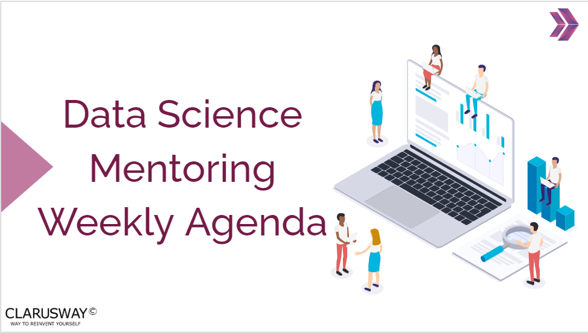

<h1><strong>Week-7 (Jan 23rd - 29th, 2023)</strong>

 

<h1><strong>Meeting Agenda</strong></h1>

▶ Icebreaking (10m) 

▶ Micro Learning & Presentations (55m) 

▶ Project Discussion (10m)

 
 
 

<h1><strong>Teamwork Schedule</strong></h1>

<table style= "width:100%;">
                <tr>
                <td style="color: #FA8072; text-align:left "><h3><strong>
Ice-breaking</td>
                <td style="color: #FA8072; text-align:right;"><h3><strong>
10m
<td>                </tr>
</table>

- Personal Questions 
- Any challenges (Classes, Coding, studying, etc.) 
- How you’re studying, you need personal advice? 
- Remember that practice makes perfect. 
- What exactly each student does for the team, if they know each other, if they care for each other, if they follow and talk with each other etc. 

 
 

<table style= "width:100%;">
                <tr>
                <td style="color: #FA8072; text-align:left "><h3><strong>
Micro Learning & Presentations</td>
                <td style="color: #FA8072; text-align:right;"><h3><strong>
55m
<td>                </tr>
</table>
(The problems and subjects in this part, has been prepared especially for you to equip yourself for the interview process and improve your coding skills. 
To get the most from this part, it’s highly recommended to be prepared and present the topics in English / German.
At first, it can be difficult to present in English / German and you can read from your notes, no problem. 
We strongly advise you to force yourself to present especially the interview questions in English / German. 
However, if you don’t feel you can present in English / German, you can do any part in Turkish, that’s no problem too. 
Please remember; we don’t want to put extra pressure to anyone, it’s totally up to you how you prepare for this section. 
The main and only aim of this part is to develop your skills that you need during and after the recruitment process and make you ready for the DS career.)

                  
  
<h3><strong>Questions & Problems Related to Course Topics</strong></h4>

**1. Please work on the Probability and Binomial Distribution related Problems below**

- [Statistics Questions-2](https://github.com/clarusway/DS-DE-0422-TR/blob/main/2-%20Weekly%20Agendas/Week_7/Statistics_Questions_2_(Probability%20%26%20Distributions)_Student.ipynb)

**2. Please work on the GSS exercises below. (Make your own copy!)**

- [GSS Practice-1](https://docs.google.com/spreadsheets/d/1AJMZ8sXZsw_dboHIirnzQNnV6DSjWUTq9EONh5Oj9q4/edit#gid=121431986)

**3. Look at the below link for Statistics and GSS.**

- [Statistical Testing: How to select the best test for your data?](https://towardsdatascience.com/statistical-testing-understanding-how-to-select-the-best-test-for-your-data-52141c305168)

- [Data Analysis in Excel: The Best Guide](https://www.simplilearn.com/tutorials/excel-tutorial/data-analysis-excel)

**4. You've learned a lot about Data Analysis so far. In order to keep this knowledge fresh and applicable, you will work on a 4 series project. All kinds of instructions about what to do and how to do are clearly in the documents.** 
                  
- [TrafficPoliceStopProject_Part-1_Preparing_The_Data_For_Analysis_Student](https://github.com/clarusway/DS-DE-0422-TR/blob/main/2-%20Weekly%20Agendas/Week_7/TrafficPoliceStopProject_Part-1_Preparing_The_Data_For_Analysis_Student.ipynb)

  
<h3><strong>Interview Questions</strong></h4>

**1. What is Bayes' Teorem?**

**2. What is the law of large numbers in statistics?**

**3. What is a hypothesis?**

 

 

<table style= "width:100%;">
                <tr>
                <td style="color: #FA8072; text-align:left "><h3><strong>
Project Discussion</td>
                <td style="color: #FA8072; text-align:right;"><h3><strong>
15m
<td>                </tr>
                
</table>

- [Statistics Assignment-02 (CIs & Hypothesis Tests)](https://lms.clarusway.com/mod/assign/view.php?id=38864)  

- Statistics Case Study-1 (Cardiovascular Disease)  

- GSS Assignment-1 (Statistical Measures)  

- [Flipgrid-5 (What is p-value and how is it used?)](https://flip.com/a0e72cf9](https://flip.com/groups/14116019/topics/34464158/responses))   
